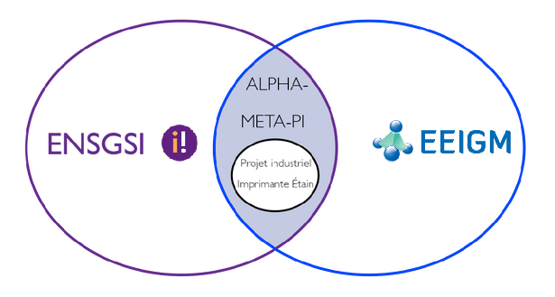
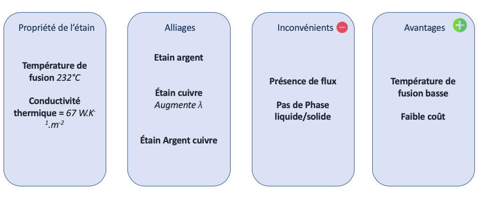
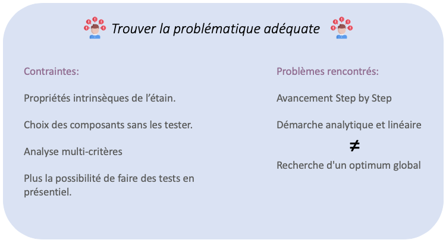
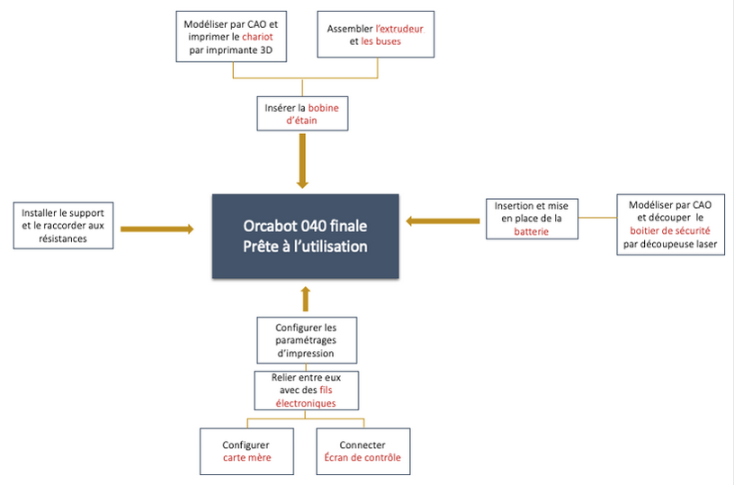
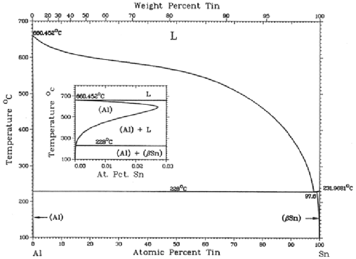
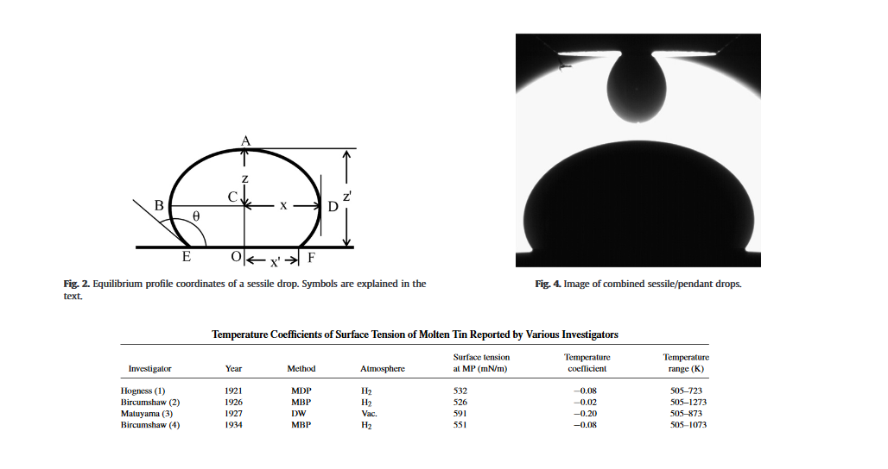
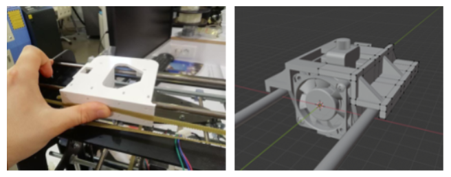
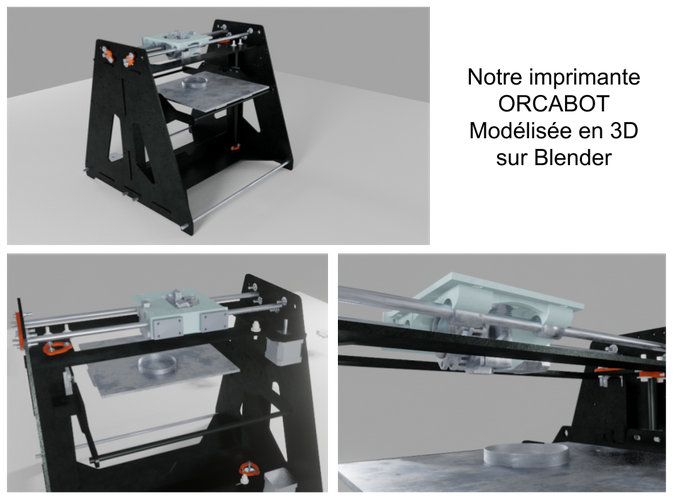

## Soutenance finale
### groupe imprimante étain
#### Projet industriel ENSGSI 1AI

Tuteur pédagogique : Aala Hassan
Tuteur Industriel : David Horwat

---

### Sommaire
 - Contexte du projet
 - Problématisation
 - Vision globale
 - Analyse et résultats
 - Conclusions et perspectives
 - Retours d'expérience

---

## Contexte du projet
 - Présentation
 - Parties prenantes
 - Objectifs

--

#### Présentation du projet et demande des industriels

--

### Parties Prenantes

--

### Objectifs

---

## Problématisation
 - Analyse de l'existant
 - Contraintes
 - Formulation

--

### Analyse de l'existant

--

### Bibliographie

--

### Chassis de l'imprimante

--

### Contraintes de l'étain

--

## Formulation

--

### Non-problématique ?

#### « Comment choisir les éléments de l’imprimante permettant d’imprimer de l'étain sans avoir à tester chacun d’eux ? »

---

## Vision globale du Projet
 - Planification
 - Démarche
 - Assemblage
 - Choix de conception

--

### Planification du projet

--

### Choix des composants

--

### Assemblage

--

### Choix de conception

---

## Analyse et résultats
 - Tests  des supports
 - Tests de dépôt
 - Tension superficielle
 - Modèle du chariot
 - Modèle de l'imprimante
 - Simulation

--

### Tests de dépôt

--

### Test des supports

--

### Tension superficielle

<aside class="notes">
sources :
https://www.sciencedirect.com/science/article/abs/pii/S0021979702985899
https://www.researchgate.net/publication/225005870_Surface_tension_of_liquid_metals_and_alloys_-_Recent_developments
</aside>

--

### Modèle du chariot

--

<!-- .slide: data-background-iframe = "https://cremesalade.github.io/prez/imprimante/chariot_viewer.html" -->

--

### Modèle de l'imprimante

--

<!-- .slide: data-background-iframe = "https://cremesalade.github.io/prez/imprimante/printer_viewer.html" -->

--

### Simulation de mécanique des fluides

--

#### Débit fort

<video controls loop height="500">
<source src="https://cremesalade.github.io/prez/imprimante/s1.mp4" type="video/mp4">
</video>

--

#### Débit résonnable

<video controls loop height="500">
<source src="https://cremesalade.github.io/prez/imprimante/s2.mp4" type="video/mp4">
</video>

---

### Conclusion et perspectives  

---

### Retours d'expériences

☺

---

# FIN !
