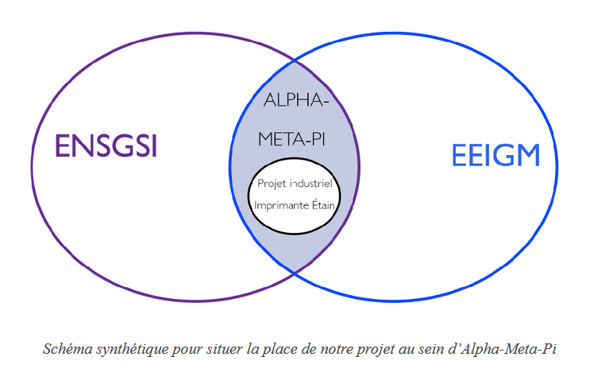
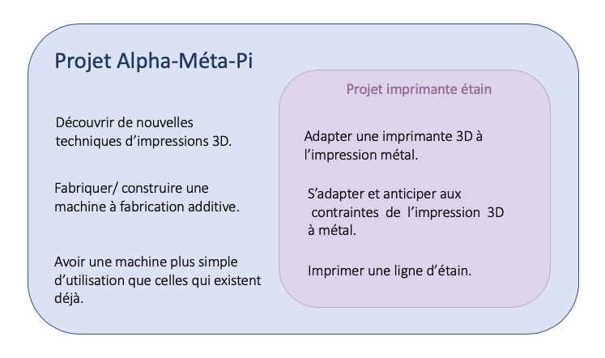
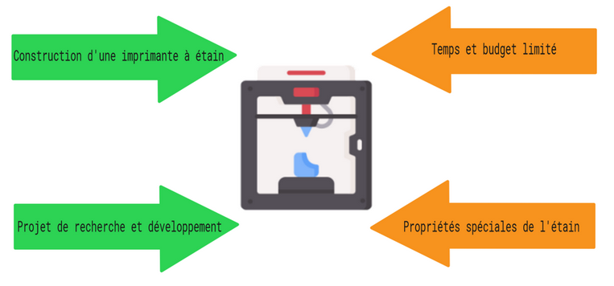
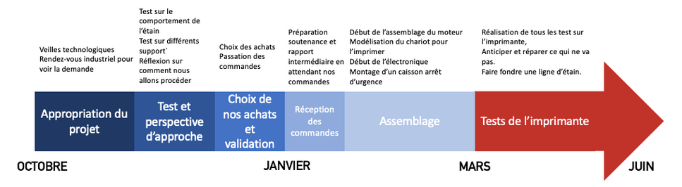
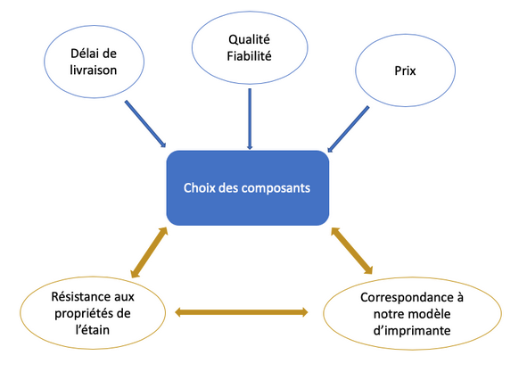
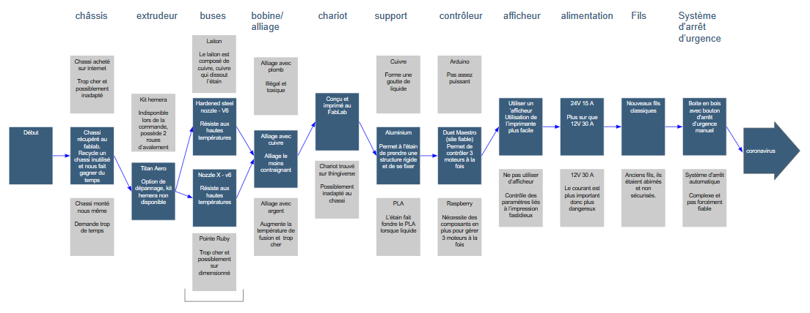
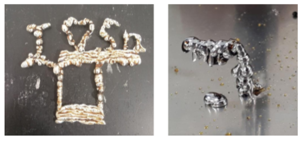
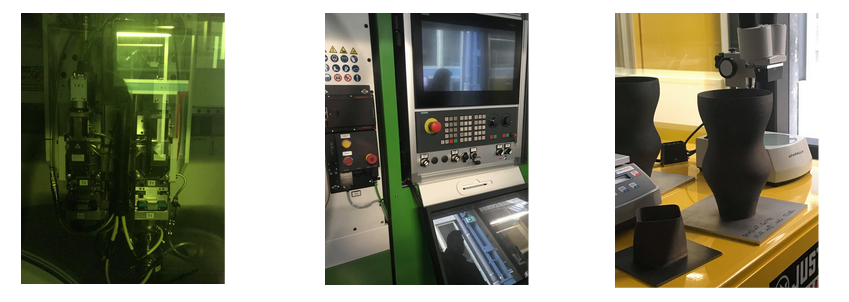
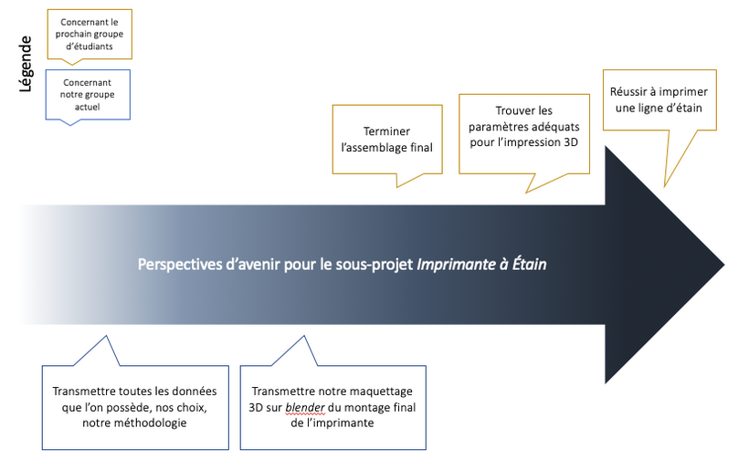

## Soutenance finale
### groupe imprimante étain
#### Projet industriel ENSGSI 1AI

---

### Sommaire
 - Contexte du projet
 - Problématisation
 - Résultats

---

## Contexte du projet

---

Contexte du projet
#### Présentation du projet et demande des industriels

---

Contexte du projet
### Parties Prenantes

---

Contexte du projet
### Objectifs

---

## Problématisation

---

### Analyse de l'existant

---

### Bibliographie

---

### Chassis de l'imprimante

---

---

### Non-problématique ?

#### « Comment permettre l’impression 3D de l'étain avec un équipement destiné à l’impression plastique alors que ces matériaux impliquent des contraintes très différentes ? »

---

### Planification du projet

---

### Choix des composants

---

### Assemblage

---

### Analyse et résultats

---

### Résultats intermédiaires
 - Tests  des supports
 - Tests de dépôt
 - Tension superficielle
 - Tests sur le chariot

---

<!-- .slide: data-background-iframe = "https://cremesalade.github.io/prez/imprimante/chariot_viewer.html" -->

---

### L'imprimante de loritz

---

### Modèle 3D

---

<!-- .slide: data-background-iframe = "https://cremesalade.github.io/prez/imprimante/printer_viewer.html" -->

---

### Simulation de mécanique des fluides

---

#### Débit fort

<video controls loop height="500">
<source src="https://cremesalade.github.io/prez/imprimante/s1.mp4" type="video/mp4">
</video>

---

#### Débit résonnable

<video controls loop height="500">
<source src="https://cremesalade.github.io/prez/imprimante/s2.mp4" type="video/mp4">
</video>

---

### Conclusion et perspectives  

---

### Retours d'expériences

---

# FIN !