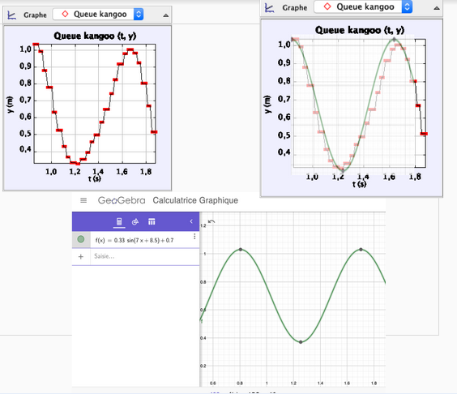
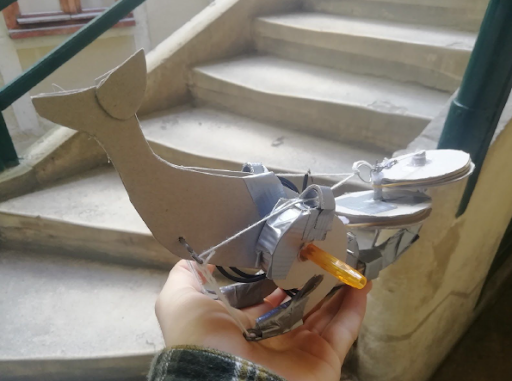
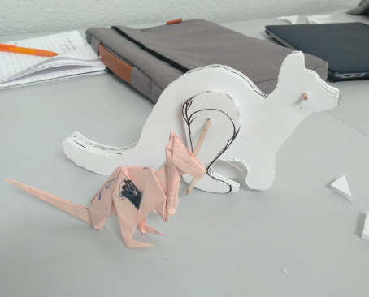
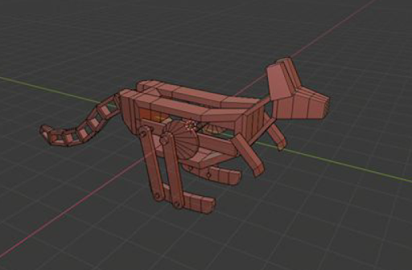
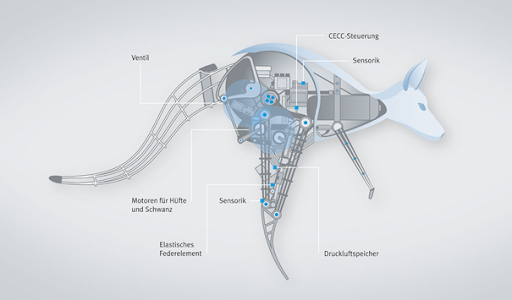
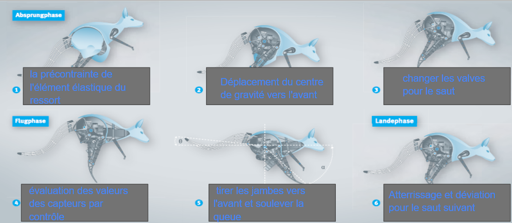
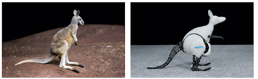

### CAO Première année
#### le Kangougroup

Machine mouvante, biomimétisme animal

KRIEGER Till,
LAURENT Alexis,
PARMANTIER Rémi,
THIOMBIANO Jessy,
LEFEVRE Rémi

---

### Sommaire

1. description du mouvement biologique
2. Les modélisations et le mécanisme
3. Le design final
4. Un exemple industriel de Festo

---

## 1. description du mouvement biologique

---

#### Le mouvement - le point de vue biologique

<video controls height="500">
<source src="https://cremesalade.github.io/prez/kangourou/k1.mp4" type="video/mp4">
</video>

---

#### Une vidéo du mouvement d’un kangourou

<video controls height="500">
<source src="https://cremesalade.github.io/prez/kangourou/pmode.mp4" type="video/mp4">
</video>

---

#### Trackage vidéo : Modélisation du mouvement

---

#### Méthode de trackage

<video controls height="500">
<source src="https://cremesalade.github.io/prez/kangourou/pmode.mp4" type="video/mp4">
</video>

---

## Les modélisations et le mécanisme

---

#### La phase de recherche - notre premier essai

---

#### La phase de recherche - notre deuxième essai

---

#### La phase de recherche - notre troisième essai

---

#### Première modélisation - SolidWorks

<video controls height="500">
<source src="https://cremesalade.github.io/prez/kangourou/pmode.mp4" type="video/mp4">
</video>

---

#### La maquette complète sur Blender

---

#### Simulation 1

<video controls height="500">
<source src="https://cremesalade.github.io/prez/kangourou/m1.mp4" type="video/mp4">
</video>
---

#### Simulation 2

<video controls height="500">
<source src="https://cremesalade.github.io/prez/kangourou/m2.mp4" type="video/mp4">
</video>
---

#### Simulation 3

<video controls height="500">
<source src="https://cremesalade.github.io/prez/kangourou/m3.mp4" type="video/mp4">
</video>
---

#### Simulation du mouvement complet

<video controls height="500">
<source src="https://cremesalade.github.io/prez/kangourou/m4.mp4" type="video/mp4">
</video>

---

## 3. Le design final

Voici le modèle en 3d

---

    <iframe title="A 3D model" height="600" width="1000" src="https://sketchfab.com/models/df15ce7132694a6a8a5ec834ce85dfc2/embed?autospin=0.2&amp;preload=1&amp;ui_controls=1&amp;ui_infos=1&amp;ui_inspector=1&amp;ui_stop=1&amp;ui_watermark=1&amp;ui_watermark_link=1" frameborder="0" allow="autoplay; fullscreen; vr" mozallowfullscreen="true" webkitallowfullscreen="true"></iframe>
    

        <a href="https://sketchfab.com/3d-models/kangaroo9-df15ce7132694a6a8a5ec834ce85dfc2?utm_medium=embed&utm_source=website&utm_campaign=share-popup" target="_blank" style="font-weight: bold; color: #1CAAD9;">kangaroo9</a>
        by <a href="https://sketchfab.com/remi.lefevre?utm_medium=embed&utm_source=website&utm_campaign=share-popup" target="_blank" style="font-weight: bold; color: #1CAAD9;">remi.lefevre</a>
        on <a href="https://sketchfab.com?utm_medium=embed&utm_source=website&utm_campaign=share-popup" target="_blank" style="font-weight: bold; color: #1CAAD9;">Sketchfab</a>
    

---

## 4. Le modèle de Festo

Une entreprise de robotique

---

### Le kangourou de Festo -  un exemple de l’industrie

---

### Le mécanisme de mouvement développé par Festo

---

### Le résultat de Festo

---

### Merci beaucoup pour votre attention !

- KRIEGER Till
- LAURENT Alexis
- LEFEVRE Rémi
- PARMANTIER Rémi
- THIOMBIANO Jessy

---

### Sources

Image1: https://i.pinimg.com/originals/53/2d/30/532d308e54a0a7f4c2103c5618aa0119.gif

Image2: https://c8.alamy.com/compde/t806nr/kangaroo-fortbewegung-t806nr.jpg

Image de Festo: https://www.festo.com/PDF_Flip/corp/Festo_BionicKangaroo/de/files/assets/basic-html/page-4.html

